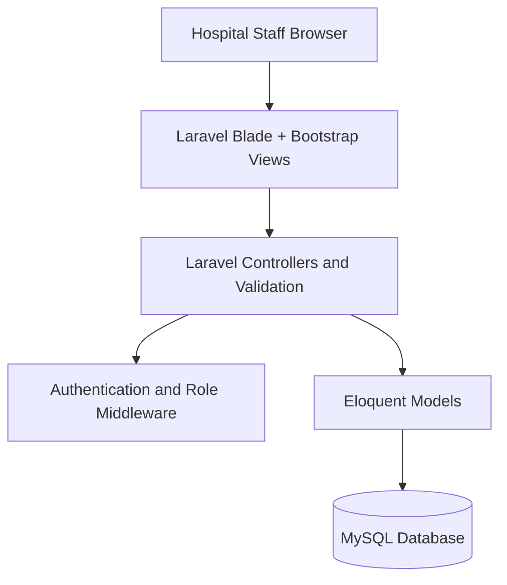
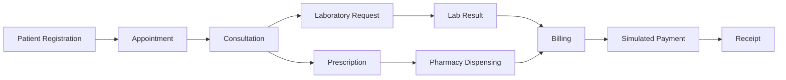
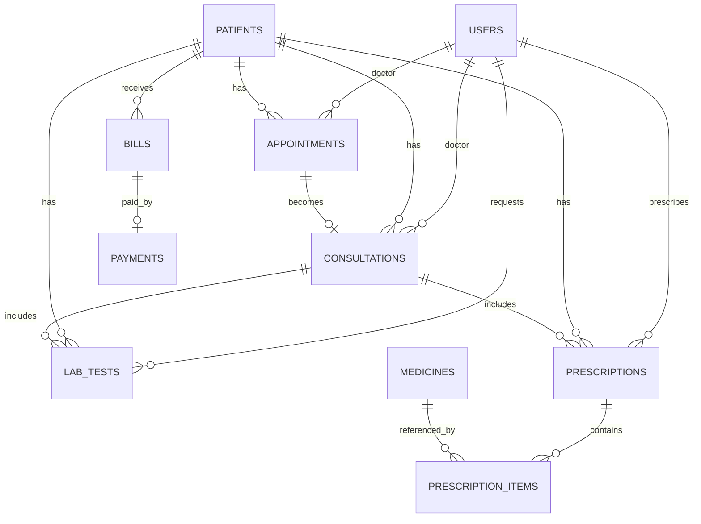

# Hospital Management System Design Summary

## 1. System Objective

The Hospital Management System is a web-based final-year project prototype designed to coordinate essential hospital workflow through a centralized relational database.

## 2. Architecture

The system intentionally uses a Laravel monolith. This reduces deployment and integration complexity while preserving clear presentation, application and database layers.

## 3. Staff Roles and Responsibilities

| Role | Main Responsibilities |
| --- | --- |
| Administrator | Staff accounts, system oversight, operational modules |
| Receptionist | Patient registration, appointments, billing and simulated payment |
| Doctor | Assigned appointments, consultations, medical records, lab requests and prescriptions |
| Laboratory Staff | Laboratory queue and test results |
| Pharmacist | Prescriptions, dispensing and medicine stock |

Patients do not have login accounts in the MVP.

## 4. Main Workflow

## 5. Core Entity Relationships

## 6. Principal Tables

| Table | Purpose |
| --- | --- |
| `users` | Staff authentication, role and account status |
| `patients` | Patient biodata and unique patient number |
| `appointments` | Patient, doctor, date, reason and appointment status |
| `consultations` | Complaint, diagnosis, treatment and clinical notes |
| `lab_tests` | Laboratory requests, results and status |
| `medicines` | Medicine names, quantity and unit price |
| `prescriptions` | Prescription header linked to patient, consultation and doctor |
| `prescription_items` | Medicine, dosage, frequency, duration and quantity |
| `bills` | Bill total, consultation link, breakdown and status |
| `payments` | Simulated payment method, reference, amount and date |

## 7. Access-Control Matrix

| Function | Admin | Receptionist | Doctor | Lab Staff | Pharmacist |
| --- | :---: | :---: | :---: | :---: | :---: |
| Patient list/profile | ✓ | ✓ | ✓ | ✓ | ✓ |
| Register/edit patient | ✓ | ✓ |  |  |  |
| Appointments | ✓ | ✓ | Assigned |  |  |
| Clinical records | Read |  | Own |  |  |
| Request lab test |  |  | ✓ |  |  |
| Enter lab result |  |  |  | ✓ |  |
| Create prescription |  |  | ✓ |  |  |
| Dispense medicine |  |  |  |  | ✓ |
| Medicine stock | ✓ |  |  |  | ✓ |
| Billing/payment | ✓ | ✓ |  |  |  |
| Staff management | ✓ |  |  |  |  |

## 8. Simulated Payment Design

Billing calculates a snapshot consisting of:

- Consultation fee.
- Laboratory test charges.
- Prescribed medicine quantity multiplied by unit price.

The snapshot is stored with the bill so the displayed receipt remains stable. Checkout records the selected prototype payment method, generates an HMS payment reference, marks the bill as paid and displays a success page. No third-party gateway is used.

## 9. Verification Strategy

The repository uses Laravel feature tests and GitHub Actions. Verification covers:

- Authentication and active/inactive accounts.
- Role middleware.
- Database migrations and core tables.
- Patient management.
- Appointments and doctor assignment.
- Consultations and privacy boundaries.
- Laboratory and pharmacy operations.
- Billing and simulated payment.
- One complete end-to-end patient journey.
- Primary page rendering for all five staff roles.

## 10. Scope Boundary

The prototype deliberately excludes insurance claims, payroll, advanced accounting, radiology imaging, surgery management, telemedicine, patient mobile apps, multi-hospital tenancy and AI diagnosis. These are future enhancements rather than requirements for the undergraduate MVP.
